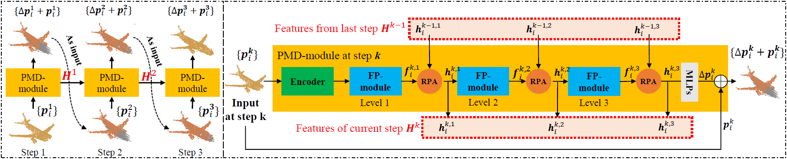

# PMP-Net++: Point Cloud Completion by Transformer-Enhanced Multi-step Point Moving Paths (TPAMI 2023)

[](pics/network.png)

## [JRS PJ]

- 针对金线补全的项目


#### Install Python Denpendencies

```
cd PMP-Net
conda create -n pmp python=3.7
conda activate pmp
pip3 install -r requirements.txt
pip install torch>=1.4.0
```

#### Build PyTorch Extensions

**NOTE:** PyTorch >= 1.4 of cuda version are required.

```
cd pointnet2_ops_lib
python setup.py install

cd ..

cd Chamfer3D
python setup.py install
```

You need to update the file path of the datasets in config_jrs.py:

```
__C.DIR.OUT_PATH                                 = ''

__C.CONST.WEIGHTS                                = ''

# for JRS
__C.JRS                                          = edict()
__C.JRS.INFERENCE_DATA_PATH                      = '/data/inference_pts'
__C.JRS.TRAIN_DATA_PATH                          = '/data/train_pts'
__C.JRS.VAL_DATA_PATH                          = '/data/val_pts'
__C.JRS.NPOINTS                                  = 2048

data: inference_pts, train_pts, val_pts
    inference_pts: partial
    train_pts: partial, gt
    val_pts: partial, gt

```

#### Training, Testing and Inference

To train PMP-Net++ or PMP-Net, you can simply use the following command:

```
python main_jrs.py  # model change between 'import PMPNetPlus' and 'import PMPNet'
```

To test or inference, you should specify the path of checkpoint if the config_*.py file
```
__C.CONST.WEIGHTS                                = "path to your checkpoint"
```

then use the following command:

```
python main_jrs.py --test
python main_jrs.py --inference
```

